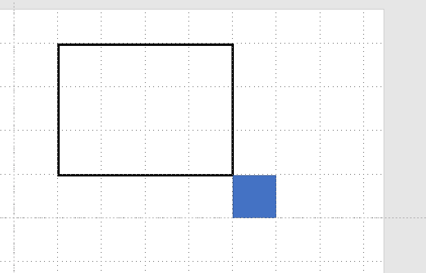

# Rectangles
## Problem: 
Given two rectangles, the program need to find if the two rectangles are ___Containing, Intersecting  or Adjacent___ to each other

### Intersection: 
You must be able to determine whether two rectangles have one or more
intersecting lines and produce a result identifying the points of intersection.
### Containment: 
You must be able to determine whether a rectangle is wholly contained within
another rectangle.
### Adjacency: 
Implement the ability to detect whether two rectangles are adjacent. Adjacency is
defined as the sharing of at least one side. Side sharing may be proper, sub-line or partial. A
sub-line share is a share where one side of rectangle A is a line that exists as a set of points
wholly contained on some other side of rectangle B, where partial is one where some line
segment on a side of rectangle A exists as a set of points on some side of Rectangle B.


### Submission Must Include:

- An implementation of the rectangle entity as well as implementations for the algorithms that define the operations listed above.
- Appropriate documentation
- Test cases/unit tests


## Solution Description 

### Inputs 
A ___Point___ representing a precise location in [X,Y] coordinate space, specified in Double.
```java
Point(Double x, Double y)
```
The ___Rectangle___ class is an immutable data type to show a two-dimensional axis-aligned Rectangle with real-value coordinates The rectangle is closed.
 
```java
Rectangle(Point bottomLeft, Point topRight)
```
bottomLeft represent the x and y values of bottom left corner of the rectangle
topRight represent the x and y values of top right corner of the rectangle
 
Once the two coordinates of the rectangle are given the constructor will generate the necessary coordinates and lines of the remaining rectangle

output
```json

{
  "intersection": "Intersection/No-Intersection ",
  "containment": "Containment/No-Containment",
  "adjacency": "Adjacent Proper/Partial Adjacent/Adjacent (Overflow)/Adjacent (Sub-line)/Not Adjacent/Vertex Share"
}
```

- The input requires two Rectangles 
```java
        Rectangle rectangle1 = new Rectangle(new Point(1.0, 1.0), new Point(5.0, 3.0));
        Rectangle rectangle2 = new Rectangle(new Point(0.0, 0.0), new Point(1.0, 3.0));
```
 
- Edge Cases checking for NaN and Invalid Rectangles are executed.
- We are initially checking for Containment first
```java
    public String contains(Rectangle other) {
        return (other.bottomLeft.getX() >= this.bottomLeft.getX()) 
                && (other.topRight.getX() <= this.topRight.getX())
                && (other.bottomLeft.getY() >= this.bottomLeft.getY()) 
                && (other.topRight.getY() <= this.topRight.getY()) 
                    ? 
                Constants.CONTAINMENT 
                    : 
                Constants.NO_CONTAINMENT;
    }
```
 

- if the rectangles are not in one other, then I am checking it for Intersection

```java

  public boolean isIntersecting(Rectangle other) {
        if (!this.contains(other).equals(Constants.CONTAINMENT)) {
            return this.topRight.getX() > other.bottomLeft.getX() && this.topRight.getY() > other.bottomLeft.getY()
                    && other.topRight.getX() > this.bottomLeft.getX()
                    && other.topRight.getY() > this.bottomLeft.getY();
        }
        return false;
    }
```
 

- if the rectangles are not in containment status and not intersecting then I am checking for sharing the borders/ checking if they are adjacent
    - As a first step I am checking for Proper Adjacent-- if the opposite lines of the rectangles are same, then it is a Proper Adjacent

```java
if (this.bottomLine.equals(other.topLine) || this.topLine.equals(other.bottomLine)
|| this.rightLine.equals(other.leftLine) || this.leftLine.equals(other.rightLine)) {
            return Constants.ADJACENT_PROPER;
        }
```
 

 - As a second step I am checking for Proper Adjacent for Internal if the rectangle is in contain status -- if the same lines of the rectangles are same, then it is a Internal Proper Adjacent

```java
 if (this.topLine.equals(other.topLine) || this.bottomLine.equals(other.bottomLine)
                || this.rightLine.equals(other.rightLine) || this.leftLine.equals(other.leftLine)) {
            return Constants.INTERNAL + Constants.ADJACENT_PROPER;
        }
```

 
 - As a third step I am checking for vertex match -- if the opposit corners of the rectangles match, then the two rectangs are sharing Vertices

```java
if (this.topRight.equals(other.bottomLeft) || this.topLeft.equals(other.bottomRight)
                || this.bottomRight.equals(other.topLeft) || this.bottomLeft.equals(other.topRight)) {
            return Constants.VERTEX_SHARE;
        }
```

 

 - Finally I am checking if the rectange which is been compared is sharing borders, partially, subline, overflow by taking the lines and comparing the
    coorinates and checking if rectange1 has the smaller border then rectange2 and viceversa.
     
```java
    private String getAdjacencyOnXAxis(Line thisLine, Line otherLine, String linesOverlappingStatus) {
        if ((thisLine.getA().getX() <= otherLine.getA().getX() && otherLine.getB().getX() <= thisLine.getB().getX())) {
            linesOverlappingStatus = Constants.ADJACENT_SUB_LINE;
        } else if (thisLine.getA().getX() >= otherLine.getA().getX() && otherLine.getB().getX() >= thisLine.getB().getX()) {
            linesOverlappingStatus = Constants.ADJACENT_OVERFLOW;
        } else if ((thisLine.getA().getX() < otherLine.getA().getX()) && (thisLine.getB().getX() < otherLine.getB().getX())
                || ((otherLine.getA().getX() < thisLine.getA().getX()) && (otherLine.getB().getX() < thisLine.getB().getX()))) {
            linesOverlappingStatus = Constants.PARTIAL_ADJACENT;
        }
        return linesOverlappingStatus;
    }

    private String getAdjacencyOnYAxis(Line thisLine, Line otherLine, String linesOverlappingStatus) {
        if (thisLine.getA().getY() <= otherLine.getA().getY() && otherLine.getB().getY() <= thisLine.getB().getY()) {
            linesOverlappingStatus = Constants.ADJACENT_SUB_LINE;
        } else if (thisLine.getA().getY() >= otherLine.getA().getY() && otherLine.getB().getY() >= thisLine.getB().getY()) {
            linesOverlappingStatus = Constants.ADJACENT_OVERFLOW;
        } else if ((thisLine.getA().getY() < otherLine.getA().getY()) && (thisLine.getB().getY() < otherLine.getB().getY())
                || ((otherLine.getA().getY() < thisLine.getA().getY()) && (otherLine.getB().getY() < thisLine.getB().getY()))) {
            linesOverlappingStatus = Constants.PARTIAL_ADJACENT;
        }
        return linesOverlappingStatus;
    }
``` 
### Scenarios Covered 
- Containment
 
---

- Intersection
 
---

- No Intersection
 
---

- Partial Adjancey
 
---

- Proper Adjancey
 
---

- Proper Internal Adjancey
 
---

- Overflowing
 
---

- Subline
 
 ---

- Vertex Share
 
---
